# CPSC 452 Final Project
### *Multi-Discriminator GAN for Airfoil Design Synthesis*
##### __Tristan Brigham, Eugene Han, Elder Veliz__

This is the repository for Yale University's CPSC 452 final project. This repository is self-contained and has all of the code necessary to gather the data for, initialize, and train a multi-discriminator gan that is able to generate airfoils with desired attributes. This readme is divided into sections for running the program, data collection, model architecture, model training, network evaluation, and further research. 

Please note that all code contained below is for a class project and should not be replicated or copied without the author's permission. It is for educational purposes only, and the authors do not intend for this to be used as the basis for any other scholastic or professional work. Please do not get us or yourself in trouble. 

Author emails for inquiries:
- [Tristan Brigham](mailto:tristan.brigham@yale.edu)
- [Eugene Han](mailto:e.han@yale.edu)

## Running the program

The process to run this program is rather simple. All scripts are provided and ready to be run. The steps are as follows:

1. Clone the repository
2. Create a virtual environment and install the requirements using `pip install -r requirements.txt`
3. Run the following scripts inside `src/data_handlers` to download and process the data. However, we recommend skipping this step and using the provided data files in the `data` folder as the collection and simulation of the data is time-consuming. Moreover, we have pruned the data to only include airfoils that are not problematic for downstream processing rather than all airfoils in the UIUC database.
    - `downloader.py` to download the airfoil data from the UIUC database
    - `preprocessor.py` to reformat the airfoil data
    - `run_lift_drag_simulations.py` to run XFOIL simulations
4. Open `full_run.ipynb` in the `notebooks` folder and run the cells. The final cells can be run as many times as desired to generate more examples of airfoils using the trained GAN and run them through XFOIL. We've included one such example inside `notebooks/demo`.

For the full running of the model, one can either choose to train the GAN from scratch (takes ~ 13 hours) or use one of the pre-trained models. The best pre-trained models can be found in the `models` folder suffixed by `_best.ckpt`.

## Data Collection

After evaluating all of the data sources that we included in our original proposal, we found that many of the datasets that we hoped to use had concerning inconsistencies in the way that they handled data and evaluated results. Hence, the data gathering process for this project came in two steps: gathering and generation. 

The vast majority of the data that is used for this machine learning model has been gathered from the [UIUC database for airfoil designs](https://m-selig.ae.illinois.edu/ads/coord_database.html). This is a great resource with over a thousand point clouds specifying airfoils that are actually used in industry and proven to be effective. 

We have provided a script that is able to ping the server that hosts the website (with latency so as not to overload the servers) and get the files for each of the airfoils on the website in `downloader.py`.

Additionally, we also used the [XFOIL](https://web.mit.edu/drela/Public/web/XFOIL/) program to generate airfoils following the [NACA](https://en.wikipedia.org/wiki/NACA_airfoil) scheme. This scheme uses a series of 4, 6, or more points depending on the version to specify unique airfoil designs. We used XFOIL to generate an exhaustive list of potential designs using these parameters which we saved to the dataset that we ended up using. 

We then cleaned all of the point clouds in the two sources above and standardized the airfoils to have exactly 50 points describing the top edge of the airfoil and exactly 50 points describing the bottom half of the airfoil. The airfoils were also all normalized to have a unit x-distance (chord).

An important thing to note is that the vast majority of the data is generated in a mach 0.3, visc=10e6 environment with XFOIL where the mach number is the velocity of the oncoming airflow and the visc value is the turbulence that exists in the oncoming flow. We did not change these parameters over the course of this experiment, and leave it as an exercise to the reader to try training a neural network that is able to respond to changes in the pressure and velocity of the simulation environment. 

## Model Architecture

The input to the GAN is a vector of normally distributed noise that can be generated with the `generate_noise()` function which takes the shape that the generator takes as input as one of the arguments concatenated with a vector specifying the intended coefficients that the user would like the outut airfoil to have. The output of the generator is a point cloud that describes an airfoil which has, according to the generator, the required coefficients specified in the input vector. 

The discriminator of the GAN contains 4 separate discriminators detailed below:

- _Lift Discriminator_ This discriminator scored the generated airfoil based on how close the lift coefficient of the airfoil described by the point cloud is to the target lift coefficient that the user has asked for. This discriminator was pre-trained on some of the dataset data in order to help with its convergence, but had a lower learning rate than the rest of the model to account for this. 
- _Momentum Discriminator_ This discriminator scored the generator on how close the momentum coefficient of the generated design was to the target momentum coefficient that we looked for in the model. This discriminator was pre-trained on some of the dataset data in order to help with its convergence, but had a lower learning rate than the rest of the model to account for this. 
- _Drag Discriminator_ This discriminator scored the generator on how close the drag coefficient of the generated design was to the target drag coefficient. This discriminator was pre-trained on some of the dataset data in order to help with its convergence, but had a lower learning rate than the rest of the model to account for this. 
- _Plausibility Discriminator_ This discriminator followed the general approach for discriminators in GAN's. It was not pre-trained and had the highest learning rate of all of the discriminators in the model. It's purpose was to attempt to figure out whether a generated design was fake (generated by the generator) or real (from the dataset). 

We found that pretraining the discriminators mentioned above resulted in better convergence for the generator. We postulate that this is because the model is better able to learn early on that the coefficients are the most important part of the airfoil and loss (despite the losses already being overweighted in the loss) which is also a result of having a valid (or plausible) design come from the generator function. Effectively, you can't have valid lift coefficients in the eyes of XFOIL without having a valid design, so the plausibility constraint was effectively built into all of the discriminators described above. 

Since we do not use Xoil persistently during the training process for the sake of time, we keep the learning rates of the pre-trained discriminators low. There is not an easily-accessed differentiable ground truth that we have during the course of training the GAN, so these networks serve as a proxy for ground truth while also being fine-tuned selectively in between epochs with generated data that is passed to XFOIL and evaluated. 

All of the parameters in the generator network and plausibility network that were being optimized over the course of training were wrapped in Adam optimizers and given varying learning rates that we found worked best of the course of several training cycles. The pre-trained discriminators had vanilla SGD optimizers to account for their pre-training and ensure that their lower learning rates were enforced. 

## Model Training

To train the model, we set the learning rate of the generator to be the highest (0.001) followed by the learning rate of the plausibility discriminator (0.0001) and the learning rates of the rest of the discriminators (0.00001). An entire model run takes ~13 hours for 100000 epochs. With that being said, we found that the optimal generator network can be found much earlier in the training cycle (around epoch 18000 depending on the learning rate), and that the stability of the training process collapses relatively soon after. The discriminator is consistently able to tell what is real and what is fake with 100% accuracy around epoch 80000. 

In order to combat the collapse of the steady state of the network training, we do not update the gradients of the discriminator when the loss of the generator network is substantially higher than the discriminator network loss. This continues until the loss values stabilize again. 

The network was trained on NVIDIA GPUs. 

## Network Evaluation

In evaluating the network, we found that the generator was able to learn the general structure and requirements for valid airfoil designs with relative ease. 
The first step in evaluation was to inspect the loss graphs for the training process. We are looking for stable losses between the generator and discriminator before either the end of the training process or a collapse in the losses where one network is too good for the other network to learn. The pretrained discriminators with the lower and non-variable learning rates should have slightly decreasing loss over the course of training, but not much given ther low learning rates. 

We find that the pretrained discriminators do not see much movement in their loss over the course of training (which means that it was a good call to pre-train them and keep their learning rates low) while the generator and the discriminator are locked in an adversarial struggle to dupe one another (which is what we want). This stability across the board is a very good indicator that the resulting generator will be tuned effectively. 

Notice that the training collapses around 20% of the way through the training when the plausibility discriminator perfectly learns what is generated and what is not and overpowers the generator. 

    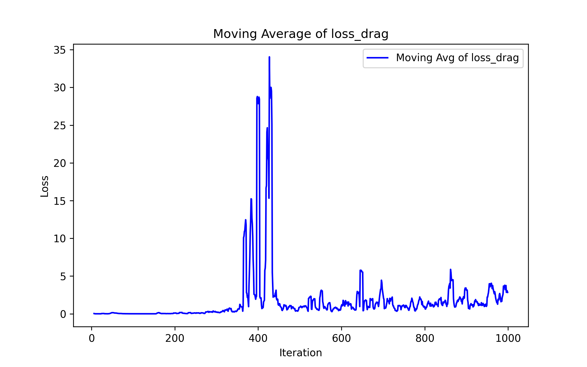
    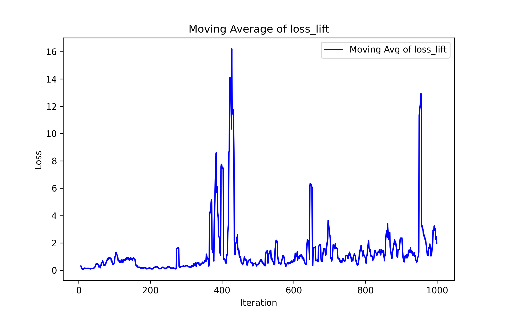
    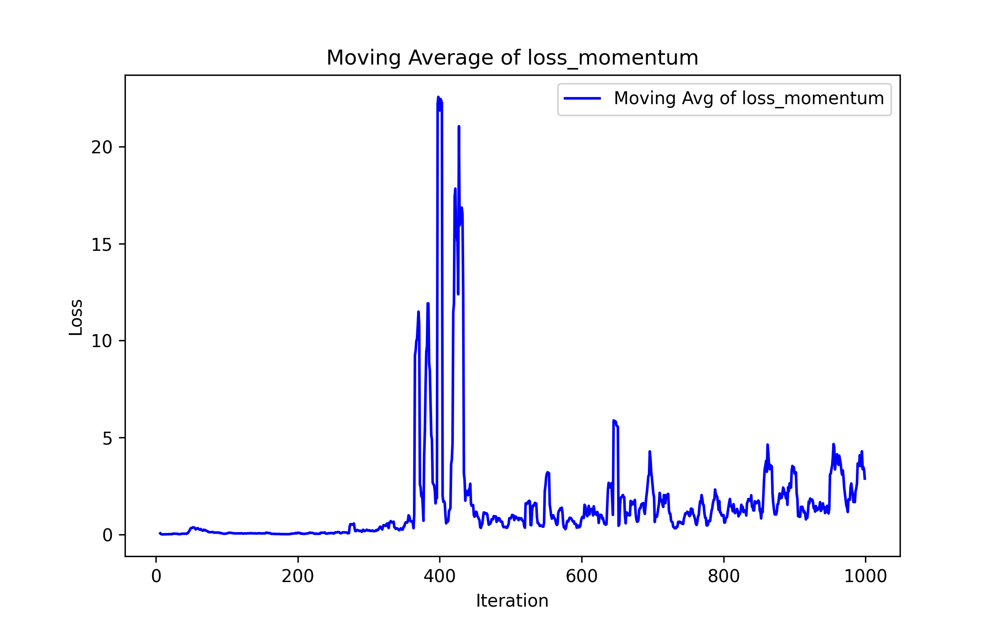  
    The loss graphs over the course of training for the pretrained discriminators.

 

    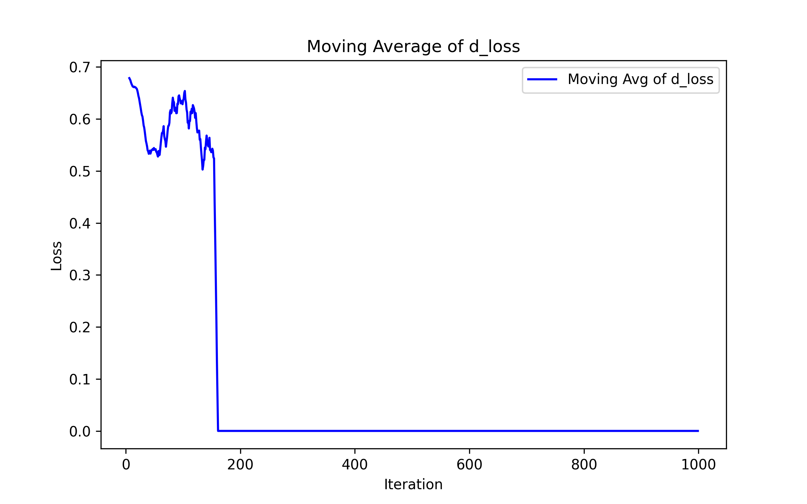
    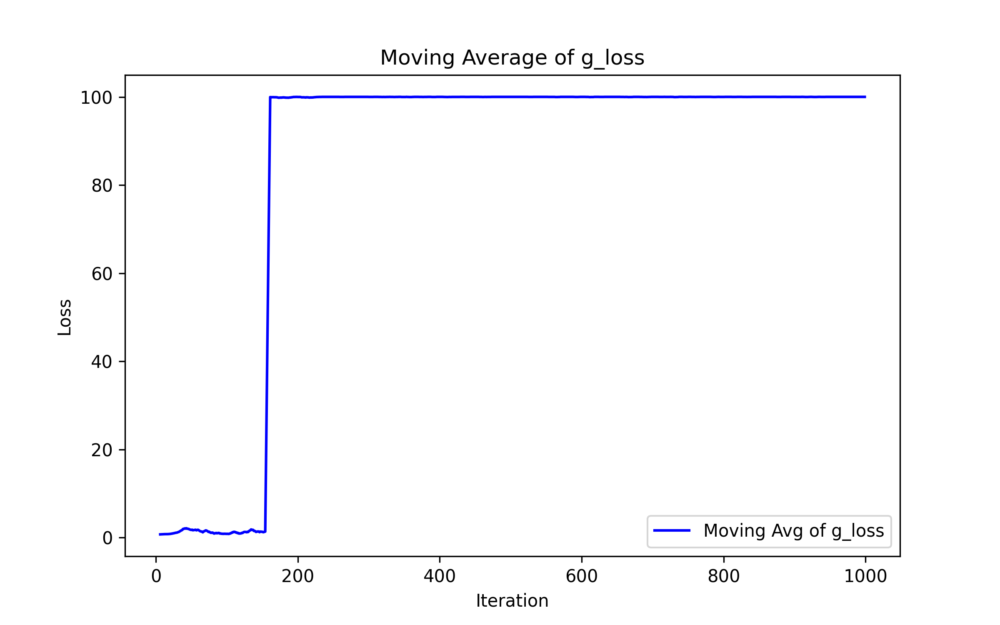  
    The loss graphs over the course of training for the generator and discriminator networks in our GAN.

 

The second test was to see whether the network is able to generate coherent airfoils or not. Given that we only allow for the airfoils to be parameterized by 100 points even though in reality it would take an infinite amount of points to model a smooth airfoil, we had to apply smoothing to the airfoils using a technique called Bezier curves. 

After applying this and normalizing the airfoils such that the generated airfoils have unit chord once again, we found that the initial results were very promising:

    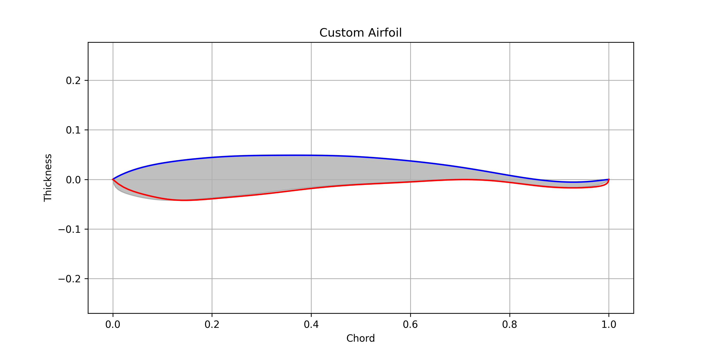  
    The first airfoil generated by the generator network after smoothing and normalization.

 

    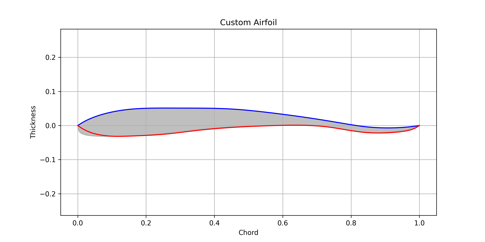
    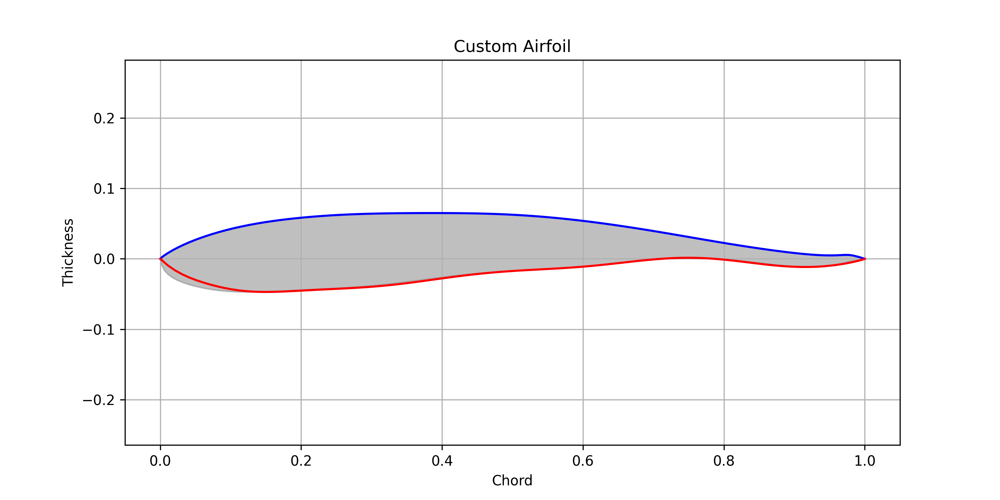
    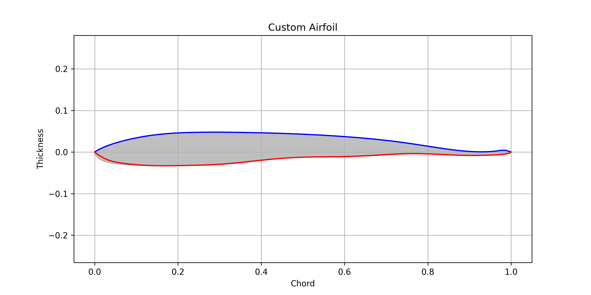  
    A few more examples of generated airfoils.

 

We find that the generator is able to produce visually valid airfoils off the bat for random target lift, momentum, and drag coefficients. This makes sense given that the loss values for the final network are relatively good. 

The model has a relatively limited domain to pull from given that all simulations are being run with a tilt of 2.0 degrees on the airfoil which is admittedly rather low. We see the distributions of each of the coefficients below. 

    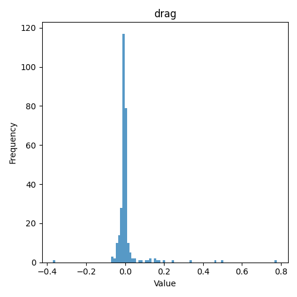
    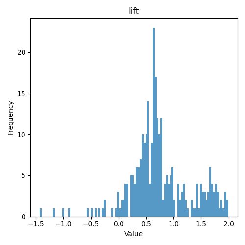
    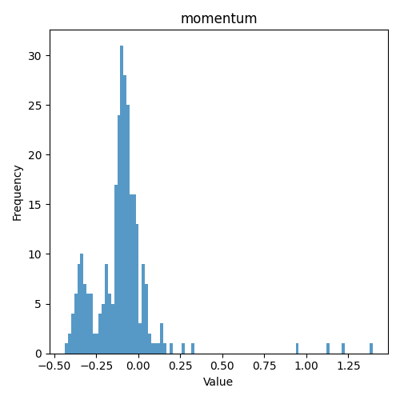

 

The following is an example of an airfoil that was generated by the generator function. We gave the generator a target lift coefficient of 0.5 with target drag equal to 0 and target momentum equal to 0 as well. The model was able to generate an airfoil with a lift coefficient of 0.4858 with lift and momentum coefficients almost equal to 0. 

    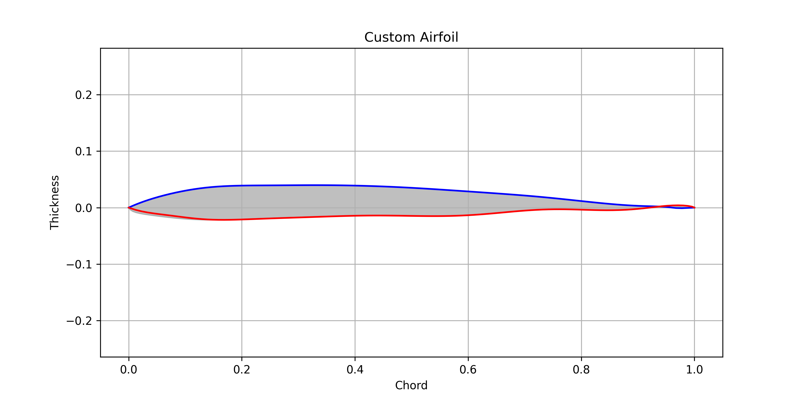  
    The output of a good generator output which is close to the target lift coefficients. This impressive generalization is common, but there are cases where issues arise.

 

Running the model again and again, we find that some of the airfoils are simply infeasible, but a wide portion of the data generates valid airfoils with our desired properties:

    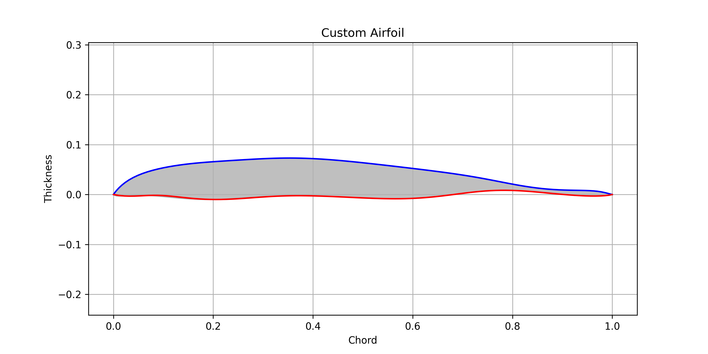  
    A generated airfoil with a lift coefficient of roughly 0.52 - an acceptable result for the model where the target lift coefficient is 0.5.

 

With that being said, the model is not perfect and there are improvements to be had with more intricate model architectures and more compute/time. 

The model has been trained with airfoils that have relatively low lift coefficients. Given our operating environment, the maximum lift coefficient possible is roughly 1.0. Most of our data is concentrated around 0.0 - 0.3 as shown above, so it makes sense that the model is not able to generalize exceptionally well to 1.0 lift coefficient targets and beyond. This is shown and confirmed below. 

    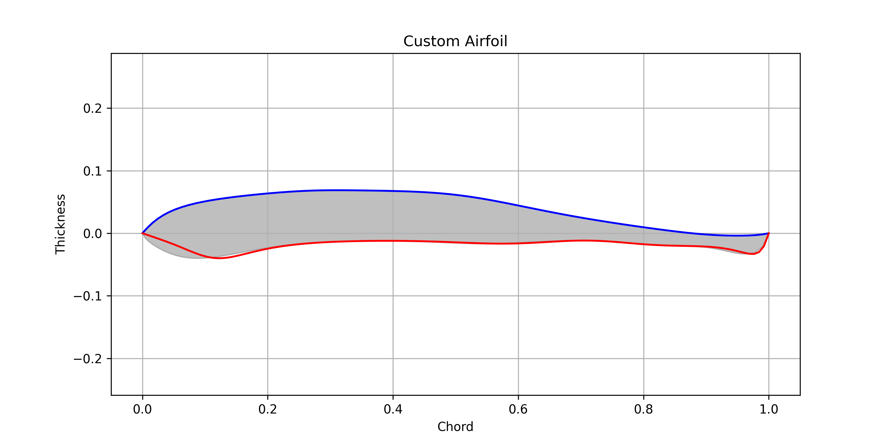  
    The model's attempt at a 1.0-lift, 0.0-drag, and 0.0-momentum airfoil. This airfoil does not have the desired lift coefficient (in fact, the lift coefficient is negative!), but is able to match the drag and momentum relatively well given that the training data had many examples of airfoils with said coefficients.

 

The following data describes the entire airfoil that has been generated for this 1.0-lift, 0.0-drag, and 0.0-momentum regime:

#### General Parameters

| Parameter        | Value     |
|------------------|-----------|
| Area             | 0.0582928 |
| Slen             | 2.05176   |
| J                | 0.000105513 |
| J/t              | 0.00662465 |
| Max Thickness X  | 0.137     |
| Max Thickness Val| 0.095576  |
| Max Camber X     | 0.353     |
| Max Camber Val   | 0.02864   |

#### X-Parameters (Solid)

| Parameter    | Value     |
|--------------|-----------|
| xc           | 0.403797  |
| max x-xc     | 0.596203  |
| min x-xc     | -0.403797 |
| iyy          | 0.00340771|
| iyy/(x-xc)   | 0.00571568|

#### Y-Parameters (Solid)

| Parameter    | Value       |
|--------------|-------------|
| yc           | 0.0158775   |
| max y-yc     | 0.0529025   |
| min y-yc     | -0.0557835  |
| ixx          | 0.0000340636|
| ixx/(y-yc)   | 0.000610639 |

#### X-Parameters (Skin)

| Parameter    | Value     |
|--------------|-----------|
| xc           | 0.499957  |
| max x-xc     | 0.500043  |
| min x-xc     | -0.499957 |
| iyy/t        | 0.176993  |
| iyy/t(x-xc)  | 0.353955  |

#### Y-Parameters (Skin)

| Parameter    | Value      |
|--------------|------------|
| yc           | 0.010336   |
| max y-yc     | 0.058444   |
| min y-yc     | -0.050242  |
| ixx/t        | 0.00247439 |
| ixx/t(y-yc)  | 0.0423377  |

### Resulting Data

| alpha | CL     | CD     | CDp    | CM    | Top_Xtr | Bot_Xtr | Top_Itr | Bot_Itr |
|-------|--------|--------|--------|-------|---------|---------|---------|---------|
| 2.000 | -0.5871| 0.00000| 0.00420| 0.2400| 0.0000  | 0.0000  | 0.0000  | 0.0000  |

## Further Research

Given the limited compute and time that we had for this project, we believe that there is a serious amount of unexploited potential left in this project. We propose potential continuations of this projet below:

- _Increase Versatility_: Through the course of this model creation and training, we only operated with three parameters for the airfoils as targets (lift, drag, and momentum coefficients). However, this is only scratching the surface of the ways that one can change an airfoil. Given that this is the case, we see the integration of more parameters and information about the airfoils that we generate as an obvious next step for this project. 
This could involve actual changes to the structure of the airfoil through more, different parameters such as shape, tensile strength,  and the distribution of internal weight being included or could include changes to the environment through perturbed mach and viscosity values. 

- _Integrate Live Evaluation_: One of the main constraints that we faced through this entire project is that the runtime for the XFOIL program is rather large. It takes a long time to actually compute the CFD calculations for any airfoil. And, even if we were able to, this is a non-differentiable function which does not provide a lot of insight or help to the generator network that is trying to learn the distribution. 
The differentiable nature of the function approximations that we got through the pretraining of the discriminators allowed the generator to learn how to create airfoils that are more valid according to the parameters given throughout training. If this is able to be replaced with a more robust method for computing the CFD simulations for a generated airfoil with the potential for more precise gradients to move the generator towards being able to create valid airfoils with closer attributes to the targets, this would be very helpful for future iterations of the models. 

- _Go Multidimensional_: As we all know, airfoils alone have limited applicability to the real world. One needs to do eons of design iteration and testing before the planes that we see and fly in are able to fly let alone be manufactured. Therefore, it would not be a stretch to imagine a similar version of this neural network that is able to generate 3-dimensional shapes with attributes that mimic target attributes. Several papers that attempt to do such a thing are included in the PDF version of the report that is included in this repository. 
This paired with other strategies such as additive manufacturing would further cut the time and cost that it takes to both operate and create the planes that manufacturers are continually iterating on, potentially creating safer planes while reducing the material costs, manufacturing complexity, and operating expenses associated with the plane. 